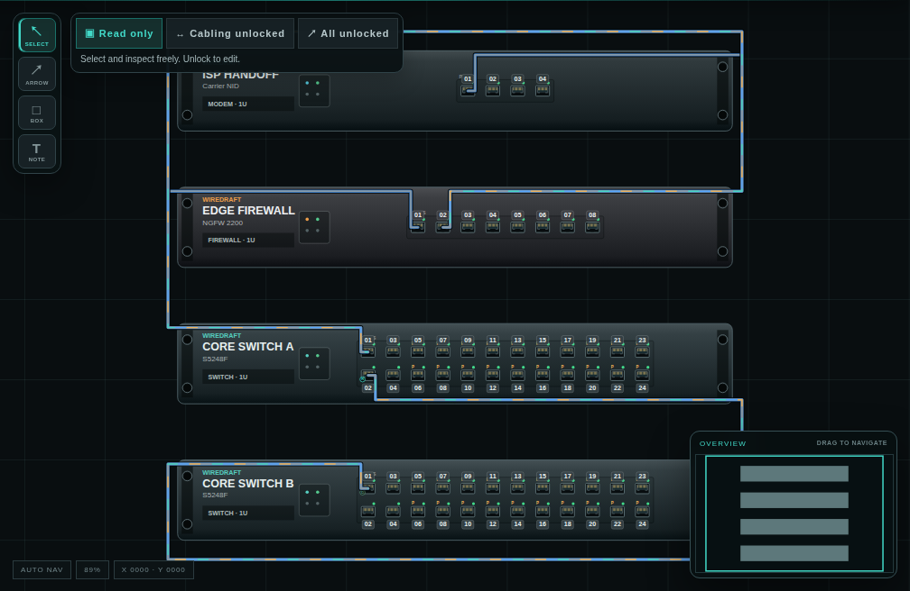
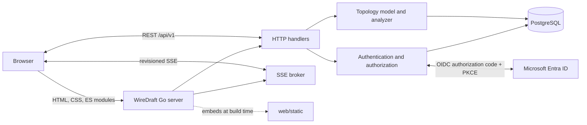
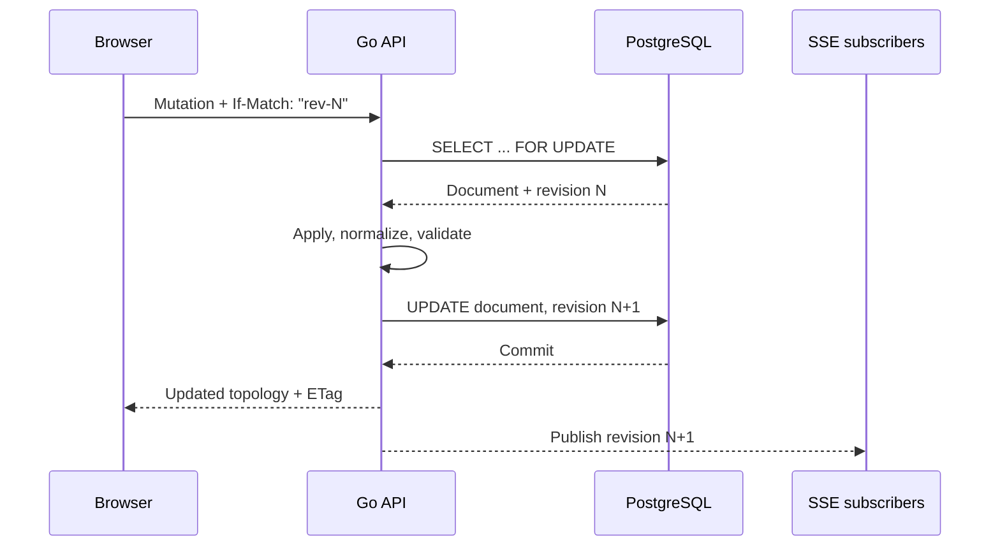
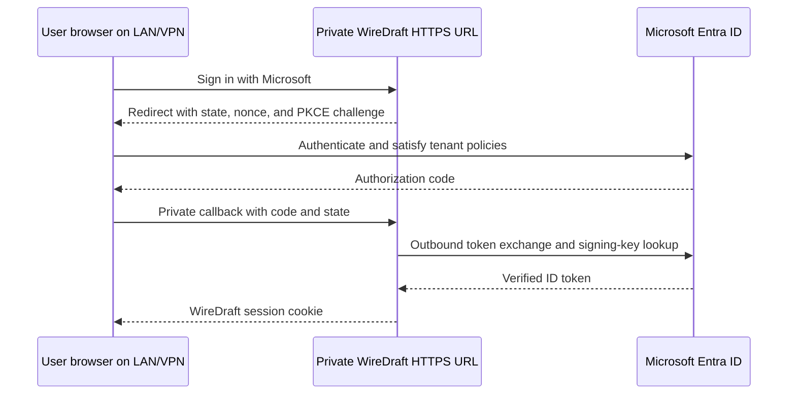

# WireDraft

<div align="center">

**Design, cable, validate, and document physical network infrastructure in one browser workspace.**

[](https://github.com/arumes31/wiredraft/actions/workflows/quality.yml)
[](https://github.com/arumes31/wiredraft/actions/workflows/lint.yml)
[](https://github.com/arumes31/wiredraft/actions/workflows/security.yml)
[](https://github.com/arumes31/wiredraft/actions/workflows/supply-chain.yml)
[](https://go.dev/)
[](https://github.com/arumes31/wiredraft/pkgs/container/wiredraft)
[](LICENSE)

[Quick start](#quick-start) · [First use](#first-use) · [GHCR](#run-the-ghcr-image) · [Entra login](#microsoft-entra-id-login) · [Configuration](#configuration) · [Architecture](#architecture) · [Development](#development)

</div>

WireDraft is a self-hosted rack, cabling, and VLAN planning application. A single Go server embeds the browser UI and API; PostgreSQL stores complete topology documents, revision metadata, users, TOTP state, recovery codes, and organization access. Uploaded field photos live in a separate private media volume and are delivered only after map-organization authorization.



## Quick start

The included Compose stack builds WireDraft locally, starts PostgreSQL, applies the initial schema to a new database, and retains data in host directories under `data/`.

### Requirements

- Docker Engine with Docker Compose v2
- Git

### Start the stack

```sh
git clone https://github.com/arumes31/wiredraft.git
cd wiredraft
cp .env.example .env
```

Open `.env` and replace both example passwords. The administrator password must contain at least 12 characters. Then start the services:

```sh
mkdir -p data/postgres data/media
# Linux only: the application container runs as UID/GID 10001.
sudo chown -R 10001:10001 data/media
docker compose up --build -d
docker compose ps
```

Open <http://localhost:8080>. View logs or stop the stack with:

```sh
docker compose logs -f wiredraft
docker compose down
```

`docker compose down`, including `docker compose down -v`, keeps the database and uploaded photos in the host directories `data/postgres` and `data/media`. Remove those directories only after making a backup.

> On PowerShell, use `Copy-Item .env.example .env` instead of `cp`.

## First use

1. Sign in with `WIREDRAFT_ADMIN_USER` and `WIREDRAFT_ADMIN_PASSWORD` from `.env`.
2. On the first administrator login, scan the QR code with a TOTP authenticator and enter its current six-digit code. If `WIREDRAFT_ADMIN_TOTP_SECRET` is already set, enrollment is skipped.
3. Download or copy the one-use recovery codes. They are displayed only when TOTP enrollment completes.
4. Open the generated demonstration map, or create a topology for an organization and location.
5. Add racks and devices, connect two ports to create a cable, then configure VLANs, bundles, switch systems, firewall clusters, documentation links, and protected field photos from the inspectors.

Guest access is enabled by default for existing guest-workspace maps. Set `WIREDRAFT_GUEST_ENABLED=false` before startup when anonymous workspace access is not wanted.

## Run the GHCR image

Images are published for `linux/amd64` and `linux/arm64`:

```sh
docker pull ghcr.io/arumes31/wiredraft:latest
```

Available tags include `latest`, `main`, `sha-<commit>`, `v<version>`, `<version>`, and `<major>.<minor>` according to the triggering branch or release tag. Use a version or digest instead of `latest` for repeatable production deployments.

The repository includes a standalone [GHCR Compose stack](docker-compose.ghcr.yml) with both the application and PostgreSQL. WireDraft embeds and applies pending schema migrations before serving requests, keeps the database and protected media in separate host directories, waits for database readiness, and runs with a read-only root filesystem and dropped Linux capabilities. The accompanying [.env.example](.env.example) lists every setting accepted by this stack with runnable defaults and placeholder credentials.

Start it from a WireDraft checkout:

```sh
cp .env.example .env
# Replace the credentials in .env before continuing.
mkdir -p data/postgres data/media
# Linux only: the application container runs as UID/GID 10001.
sudo chown -R 10001:10001 data/media
docker compose -f docker-compose.ghcr.yml pull
docker compose -f docker-compose.ghcr.yml up -d
```

Set `WIREDRAFT_IMAGE` in `.env` to pin a release tag or digest without editing the Compose file, for example `WIREDRAFT_IMAGE=ghcr.io/arumes31/wiredraft:1.2.3`.

Compose-specific settings are separate from the application configuration below:

| Environment variable | Default | Description |
| --- | --- | --- |
| `COMPOSE_PROJECT_NAME` | `wiredraft` | Compose project and generated resource-name prefix |
| `WIREDRAFT_IMAGE` | `ghcr.io/arumes31/wiredraft:latest` | Application image tag or digest |
| `POSTGRES_IMAGE` | pinned PostgreSQL 17 Alpine digest | PostgreSQL image tag or digest |
| `WIREDRAFT_BIND_ADDRESS` | `0.0.0.0` | Host address that publishes the web port; use `127.0.0.1` behind a local reverse proxy |
| `WIREDRAFT_PUBLISHED_PORT` | `8080` | Host-side web port |
| `POSTGRES_DB` | `wiredraft` | Database initialized in a new PostgreSQL data directory |
| `POSTGRES_USER` | `wiredraft` | Database owner initialized in a new PostgreSQL data directory |
| `POSTGRES_PASSWORD` | required | Password for the bundled PostgreSQL container; replace the placeholder before startup |

The app connection defaults (`PGDATABASE`, `PGUSER`, and `PGPASSWORD`) must match the bundled PostgreSQL settings. `PGPASSWORD` may be left empty in `.env` to reuse `POSTGRES_PASSWORD`. For an external database, set `DATABASE_URL` or the five `PG*` connection variables; the included PostgreSQL service will still start unless you remove it from the copied deployment file. The configured database role must own the application schema or otherwise be allowed to apply its versioned DDL migrations.

`PORT` is the container-side listen port while `WIREDRAFT_PUBLISHED_PORT` is the host-side port. If `PORT` changes, update `HEALTHCHECK_URL` to the same container port. `WIREDRAFT_MEDIA_DIR` must be an absolute in-container path in this Compose deployment; the protected `data/media` host directory is mounted at that path automatically.

The published runtime image is `FROM scratch`, contains only the statically linked server, runs as numeric user `10001`, and has no shell or package manager. Its built-in `-healthcheck` command probes `/api/v1/health` without adding a second binary.

## Features

### Rack and hardware planning

- Multi-rack layouts with 6U–48U frames, independent front/rear rails, per-rack face switching, whole-U snapping, collision prevention, hidden-side silhouettes, grouped cable portals, trace-expanded dual-face views, capacity reporting, free-floating devices, and a navigable minimap.
- High-DPI faceplates for switches, firewalls, routers, carrier handoffs, modems, access points, servers, patch panels, storage, power, and console equipment.
- Offline 542-profile hardware catalog with vendor-family layouts and 25 connector types up to 800G OSFP, plus JSON profile import.
- Generic 1U–4U server rear builder with mixed card bays and independently cableable ports.
- Copper and fiber patch panels with independent front/rear occupancy, editable rear mappings, and atomic one-to-one panel ranges.

### Physical cabling

- Magnetic port-to-port drafting with precise connector hit testing and automatic endpoint link-state updates.
- Deterministic orthogonal routing, rack-side/inter-rack gutters, crossing underpasses, bundled device-pair tracks, and separated vertical lanes in dense layouts.
- Cable media and transceiver metadata for copper, coax, SMF/MMF, DAC, AOC, and twinax.
- Trunk, LACP, MC-LAG, and failover link groups with shared labels, primary/backup roles, group-wide VLAN editing, and complete-path hover highlighting.
- Canvas and SVG exports use the same Manhattan route geometry and native/tagged VLAN conductors.

### Layer 2 modeling and analysis

- Access, trunk, hybrid, and unconfigured switchport models with native and tagged VLAN membership.
- Logical switch systems for generic stacks, Aruba VSF, Cisco StackWise/VSS, Fortinet MC-LAG, Juniper Virtual Chassis, HPE/H3C IRF, and custom fabrics.
- Active/active and active/passive firewall clusters with active-member selection and safe failover reassignment.
- Per-VLAN spanning-tree simulation with deterministic root election and Root, Designated, and Blocked port roles.
- Server-side detection of native VLAN mismatches, tagged VLAN drops, switching loops, invalid bundles, and forwarding paths.

### Collaboration and output

- Revision-aware autosave, manual save, undo/redo, optimistic conflict detection, and per-topology Server-Sent Events.
- Anchored comment threads, HTTP(S) documentation links, and revocable tokenized read-only shares.
- Export to A3 PDF, self-contained interactive HTML, configuration workbook, PNG, SVG, and JSON; the HTML viewer embeds its CSS, source data, search, pan/zoom, hover tracing, face filters, and inspector without remote assets, while JSON can be restored as a topology backup.
- Device inventory for hostname, management IP, serial, asset tag, owner/team, site hierarchy, rack/U position, and STP priority.

### Runtime and security

- Local password and TOTP authentication, optional single-tenant Microsoft Entra ID login, one-use recovery codes, opaque host-bound sessions, organization-scoped users, and administrator user management.
- Strict JSON decoding, request size limits, same-origin and CSRF enforcement, security headers, structured logs, database transactions, and graceful shutdown.
- Embedded native ES-module frontend with no runtime Node.js dependency; release builds minify modules before `go:embed` compilation.
- Responsive controls, keyboard-visible focus, reduced-motion support, adaptive graphics quality, bounded frame rates, and suspended rendering for hidden canvases.

## Architecture



WireDraft stores each topology as a validated JSONB aggregate alongside indexed summary and revision fields. Mutations lock the row, enforce the optional `If-Match: "rev-N"` precondition, validate the next aggregate, increment its revision, and commit atomically.



### Persistent data

| Persistent item | Contents |
| --- | --- |
| `topologies` | Complete topology JSONB documents plus name, organization, location, revision, counts, and timestamps |
| `auth_state` | Users, organization grants, password/TOTP/recovery state, guest workspace membership, and the 32-byte key used to encrypt authenticator secrets |
| `data/postgres` host directory | The complete database used by the included Compose deployment |
| `data/media` host directory | Randomly renamed JPEG/PNG attachments, isolated by topology and never exposed as a browsable static directory |

Back up PostgreSQL and `data/media` together to preserve topology, authentication state, and uploaded photos. A JSON export contains attachment metadata but not the photo bytes, so it is not a replacement for these backups.

```sh
docker compose exec -T postgres sh -c 'exec pg_dump -U "$POSTGRES_USER" -d "$POSTGRES_DB"' > wiredraft-backup.sql
```

PostgreSQL runs on `127.0.0.1:5432` in the included development Compose file. Do not expose it publicly. WireDraft applies pending migrations from the schema files embedded in its binary before opening the HTTP server. This initializes fresh databases and upgrades existing databases automatically; startup stops with an error if a migration cannot be applied.

## Configuration

WireDraft reads environment variables first and lets command-line flags override the supported server options.

| Environment variable | Flag | Default | Description |
| --- | --- | --- | --- |
| `PORT` | `-port` | `8080` | HTTP listen port |
| `DATABASE_URL` | — | empty | PostgreSQL URL; when empty, pgx reads the standard `PGHOST`, `PGPORT`, `PGDATABASE`, `PGUSER`, `PGPASSWORD`, and related variables |
| `PGHOST` | — | pgx default | PostgreSQL host when `DATABASE_URL` is empty; the GHCR Compose stack uses `postgres` |
| `PGPORT` | — | pgx default | PostgreSQL port when `DATABASE_URL` is empty; the GHCR Compose stack uses `5432` |
| `PGDATABASE` | — | pgx default | PostgreSQL database when `DATABASE_URL` is empty; the GHCR Compose stack uses `wiredraft` |
| `PGUSER` | — | pgx default | PostgreSQL user when `DATABASE_URL` is empty; the GHCR Compose stack uses `wiredraft` |
| `PGPASSWORD` | — | pgx default | PostgreSQL password when `DATABASE_URL` is empty; Compose reuses `POSTGRES_PASSWORD` when this is unset |
| `WIREDRAFT_MEDIA_DIR` | `-media-dir` | `data/media` | Private photo root; Compose sets this to `/media` and mounts the host `data/media` directory there |
| `LOG_LEVEL` | `-log-level` | `info` | `debug`, `info`, `warn`, or `error` |
| `LOG_FORMAT` | `-log-format` | `json` | `json` or `text` |
| `WIREDRAFT_ADMIN_USER` | — | `admin` | Bootstrap administrator username |
| `WIREDRAFT_ADMIN_PASSWORD` | — | required | Bootstrap administrator password; minimum 12 characters |
| `WIREDRAFT_ADMIN_TOTP_SECRET` | — | empty | Optional Base32 TOTP secret; empty starts QR enrollment on first login |
| `WIREDRAFT_GUEST_ENABLED` | — | `true` | Enables guest-workspace login |
| `WIREDRAFT_COOKIE_SECURE` | — | `false` | Sends the session cookie only over HTTPS |
| `WIREDRAFT_ENTRA_ENABLED` | — | `false` | Enables the Microsoft Entra ID login button and OIDC endpoints |
| `WIREDRAFT_ENTRA_TENANT_ID` | — | empty | Directory (tenant) ID of the single permitted Entra tenant |
| `WIREDRAFT_ENTRA_CLIENT_ID` | — | empty | Application (client) ID of the WireDraft app registration |
| `WIREDRAFT_ENTRA_CLIENT_SECRET_FILE` | — | empty | Path to a read-only file containing the app registration client secret |
| `WIREDRAFT_ENTRA_REDIRECT_URL` | — | empty | Exact HTTPS callback registered in Entra, ending in `/api/v1/auth/entra/callback` |
| `HEALTHCHECK_URL` | `-healthcheck-url` | `http://127.0.0.1:8080/api/v1/health` | Target used with `-healthcheck` |

During the rename migration window, `NETDIAGRAM_GUEST_ENABLED` and `NETDIAGRAM_COOKIE_SECURE` remain fallback aliases when their `WIREDRAFT_*` replacements are unset.

## Microsoft Entra ID login

WireDraft can use a private Microsoft 365 work account as an alternative login. This is an optional, single-tenant OpenID Connect integration: the local administrator remains available for recovery and explicitly pre-provisions every Entra user and their organization grants.

No inbound Internet port is required. The user's browser visits Microsoft and is redirected back to WireDraft's private HTTPS name; Microsoft does not initiate a connection to WireDraft. The WireDraft container needs outbound DNS and HTTPS access to `login.microsoftonline.com` and to the endpoints in Microsoft's OIDC discovery document.



### 1. Prepare the private URL

Give WireDraft a stable DNS name that enrolled clients can resolve, for example `wiredraft.internal.example.com`. Terminate TLS with a certificate trusted by those clients and proxy requests to the WireDraft container. The callback in this example is:

```text
https://wiredraft.internal.example.com/api/v1/auth/entra/callback
```

The scheme, host, port, path, and letter case must match the Entra redirect URI exactly. A private CA, split DNS, LAN-only address, or VPN-only address is valid as long as each signing-in browser can reach and trust it. Set `WIREDRAFT_BIND_ADDRESS=127.0.0.1` when the reverse proxy runs on the Docker host. When the proxy is another Compose service, keep WireDraft on a private Docker network and do not publish its application port publicly.

### 2. Register WireDraft in Entra

1. Open the [Microsoft Entra admin center](https://entra.microsoft.com), then go to **Identity > Applications > App registrations > New registration**.
2. Enter a recognizable name such as `WireDraft` and select **Accounts in this organizational directory only**. WireDraft intentionally rejects tokens from any other tenant.
3. Open **Authentication > Add a platform > Web** and add the exact callback URL from the previous section. Do not configure the SPA platform, implicit grant, or a logout URL for this integration.
4. Copy the **Directory (tenant) ID** and **Application (client) ID** from **Overview**.
5. Open **Certificates & secrets > Client secrets > New client secret**, choose the shortest practical expiry, and securely copy the secret value while it is visible. WireDraft reads it from a file and never accepts it through the browser.
6. Leave API permissions at the default OpenID Connect sign-in permissions. WireDraft requests `openid profile email`; it does not request Microsoft Graph or `offline_access`.
7. Open the matching **Enterprise application > Properties**, set **Assignment required?** to **Yes**, and assign only the intended users or groups under **Users and groups**. Group assignment availability depends on the Entra edition. Without assignment enforcement, Entra generally permits every tenant user to reach the application login.
8. Apply your normal Entra MFA and Conditional Access policy. Entra-backed WireDraft accounts do not enroll in WireDraft's local TOTP because Entra owns their primary authentication policy.

Microsoft's references cover [app registration](https://learn.microsoft.com/en-us/entra/identity-platform/quickstart-register-app), [redirect URI rules](https://learn.microsoft.com/en-us/entra/identity-platform/reply-url), [authorization code flow with PKCE](https://learn.microsoft.com/en-us/entra/identity-platform/v2-oauth2-auth-code-flow), and [enterprise application assignment](https://learn.microsoft.com/en-us/entra/identity/enterprise-apps/ways-users-get-assigned-to-applications).

### 3. Mount the client secret

Create a file outside the repository and restrict it to the account that manages the deployment. Do not put the secret in `.env`, a Compose file, an image layer, or Git.

```sh
mkdir -p secrets
printf '%s' 'paste-the-client-secret-value-here' > secrets/wiredraft_entra_client_secret
sudo chown 10001:10001 secrets/wiredraft_entra_client_secret
sudo chmod 0400 secrets/wiredraft_entra_client_secret
```

The numeric ownership matches the non-root user in the published image. On Docker Desktop or a rootless engine, use the platform's equivalent secret-file permissions and confirm that container UID `10001` can read the bind mount.

Create `docker-compose.entra.yml` next to the supplied GHCR Compose file:

```yaml
services:
  wiredraft:
    volumes:
      - type: bind
        source: ./secrets/wiredraft_entra_client_secret
        target: /run/secrets/wiredraft_entra_client_secret
        read_only: true
```

The supplied `.gitignore` and `.dockerignore` keep `secrets/` out of version control and image build contexts. WireDraft rejects an empty secret or a secret file larger than 16 KiB and loads the value only at startup.

### 4. Enable the provider

Set these values in `.env`:

```dotenv
WIREDRAFT_COOKIE_SECURE=true
WIREDRAFT_ENTRA_ENABLED=true
WIREDRAFT_ENTRA_TENANT_ID=00000000-0000-0000-0000-000000000000
WIREDRAFT_ENTRA_CLIENT_ID=11111111-1111-1111-1111-111111111111
WIREDRAFT_ENTRA_CLIENT_SECRET_FILE=/run/secrets/wiredraft_entra_client_secret
WIREDRAFT_ENTRA_REDIRECT_URL=https://wiredraft.internal.example.com/api/v1/auth/entra/callback
```

Start or recreate the stack with both Compose files:

```sh
docker compose -f docker-compose.ghcr.yml -f docker-compose.entra.yml pull
docker compose -f docker-compose.ghcr.yml -f docker-compose.entra.yml up -d
docker compose -f docker-compose.ghcr.yml -f docker-compose.entra.yml logs wiredraft
```

Entra configuration errors fail startup instead of silently weakening login. OIDC discovery is lazy, so a temporary Entra outage does not prevent the server or local administrator login from starting.

### 5. Pre-provision and link users

1. Sign in as the local WireDraft administrator.
2. Open **Identity Control**, select **Microsoft Entra** as the account source, enter the WireDraft display username and the user's exact current Entra sign-in name (UPN), then grant the required organizations.
3. Ask the user to select **Sign in with Microsoft**. On the first successful login, WireDraft matches the verified UPN once and binds the account to the immutable Entra tenant/object pair (`tid` + `oid`).
4. After linking, UPN or display-name changes do not change authorization. If Microsoft deletes and recreates the identity, verify the replacement account and use **Reset Entra link** before the next login.

Assignment in Entra and pre-provisioning in WireDraft are both required. An authenticated tenant user who has no matching enabled WireDraft account is rejected. Entra accounts cannot be administrators; keep at least one strong local administrator account for recovery.

WireDraft validates the token issuer, signature, audience, expiry, nonce, tenant, and authorization flow state. It stores only the stable `tid`/`oid` binding and display metadata—never ID tokens, access tokens, refresh tokens, or Microsoft passwords. The local logout ends the WireDraft session but does not globally sign the browser out of Microsoft 365.

### Operations and troubleshooting

| Symptom | Check |
| --- | --- |
| Microsoft button is absent | `WIREDRAFT_ENTRA_ENABLED=true`, valid startup configuration, and the current container version |
| Startup rejects the configuration | All five Entra variables are set, the callback is absolute HTTPS, `WIREDRAFT_COOKIE_SECURE=true`, and the secret file is mounted and readable by UID `10001` |
| `AADSTS50011` | The registered Web redirect URI and `WIREDRAFT_ENTRA_REDIRECT_URL` differ; compare every character |
| Microsoft succeeds but the browser cannot return | The client cannot resolve, route to, or trust TLS for the private WireDraft name |
| WireDraft rejects the authenticated user | Wrong tenant, no enabled pre-provisioned account, UPN mismatch on first login, or a stale identity binding after account recreation |
| Provider temporarily unavailable | Verify container DNS, time synchronization, CA trust, and outbound TCP 443 to Microsoft's discovered endpoints |

To rotate the secret, create a second Entra client secret, replace the mounted file securely, recreate the WireDraft container, verify login, and then delete the old secret. To disable Entra login, set `WIREDRAFT_ENTRA_ENABLED=false` and recreate the container. Existing bindings remain stored for a later re-enable, and local authentication remains available.

### Production checklist

- Use long, unique values for the database and administrator passwords.
- Disable guest access unless it is intentionally required.
- Terminate TLS at a trusted reverse proxy and set `WIREDRAFT_COOKIE_SECURE=true`.
- Keep PostgreSQL on a private network and back up `data/postgres`.
- Back up `data/media` with PostgreSQL; do not publish or serve the media directory directly from a reverse proxy.
- Pin the WireDraft image to a release tag or digest; WireDraft applies its embedded database migrations during startup.
- Preserve the `auth_state` row with the rest of the database; its encryption key is required to read stored TOTP secrets.
- Run one WireDraft application replica. Authentication state is currently maintained as one PostgreSQL aggregate and is not yet safe for concurrent writers across multiple replicas.

## HTTP API

The versioned API is rooted at `/api/v1`.

| Area | Routes |
| --- | --- |
| Health and authentication | `/health`, `/auth/*`, `/admin/users` |
| Topologies and inventory | `/topologies`, `/topologies/{id}`, `/racks`, `/devices`, `/ports` |
| Protected photos | `/topologies/{id}/photos` and `/topologies/{id}/photos/{photoId}` |
| Cabling and logical systems | `/links`, `/link-groups`, `/switch-systems`, `/firewall-clusters` |
| Network intent | `/vlans`, `/analysis`, `/trace` |
| Collaboration | `/events`, `/comments`, `/documentation-links`, `/shares` |
| Public read-only access | `/shared/{topologyId}/{token}` |

Mutations support optimistic concurrency with `If-Match: "rev-N"`. Error responses use `{ "error": "message", "code": 400 }`. The browser client is the current request-body reference, and the persisted domain schema is defined in `internal/model`.

## Development

### Toolchain

- Go 1.26.5 or later
- PostgreSQL 14 or later
- Node.js 24 for tests and release-time minification only
- Docker, PowerShell 7, and the quality tools listed in [CONTRIBUTING.md](CONTRIBUTING.md) for the full CI mirror

Start PostgreSQL from Compose and run the application natively:

```sh
docker compose up -d postgres
```

```powershell
$env:PGHOST = "127.0.0.1"
$env:PGPORT = "5432"
$env:PGDATABASE = "wiredraft"
$env:PGUSER = "wiredraft"
$env:PGPASSWORD = "the-password-from-.env"
$env:WIREDRAFT_ADMIN_PASSWORD = "a-long-local-admin-password"
go run ./cmd/server
```

Build a static binary:

```sh
make build
./wiredraft
```

Without `make`:

```sh
go build -trimpath -ldflags="-s -w" -o wiredraft ./cmd/server
```

### Tests and quality gates

```sh
go test ./...
go test -race ./...
npm ci
npm run test:unit
npm run test:coverage
npm run test:e2e
```

The Core CI workflow enforces at least 70% Go statement coverage and 80% frontend line, function, and branch coverage. Run the complete locally reproducible suite from PowerShell 7 before review:

```powershell
pwsh -NoProfile -File scripts/ci-local.ps1
```

For quicker iteration, `-SkipBrowsers` and `-SkipContainers` are available. The full command also checks formatting, lint, race/fuzz coverage, dependencies, secrets, Docker, SBOM output, mutation behavior, supported browsers, accessibility, and visual regression. GitHub additionally runs CodeQL, dependency review, OpenSSF Scorecard, and build/SBOM attestations.

### Project layout

```text
cmd/server/          Application entry point and health probe
internal/auth/       Password, TOTP, recovery, sessions, and user access
internal/config/     Environment and flag parsing
internal/handler/    HTTP API, middleware, static delivery, and authorization
internal/model/      Topology domain, validation, STP, tracing, and analysis
internal/store/      PostgreSQL persistence, embedded migrations, and revision transactions
internal/sse/        Per-topology event broker
web/static/          Embedded browser application
web/*_test.mjs       Frontend unit and contract tests
e2e/                 Playwright, accessibility, and visual tests
scripts/             CI mirror, minification, and mutation helpers
```

## Contributing

Read [CONTRIBUTING.md](CONTRIBUTING.md) before opening a pull request. Keep changes focused, add tests for behavioral changes, and call out persistence or API compatibility effects.

Security issues should be reported privately as described in [SECURITY.md](SECURITY.md).

## License

WireDraft is available under the [MIT License](LICENSE).
